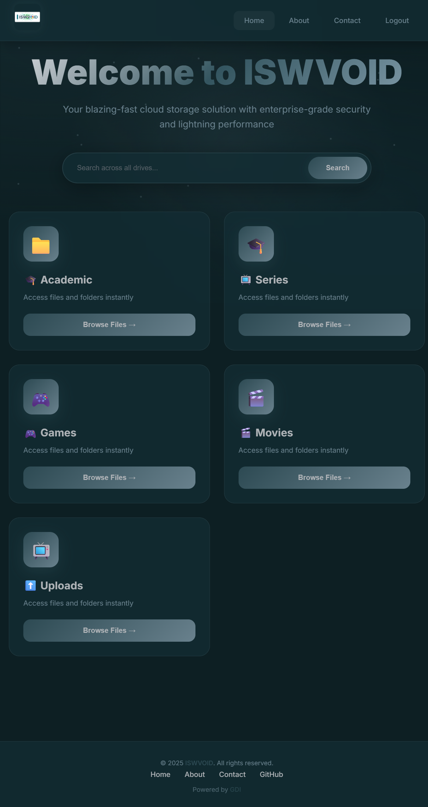
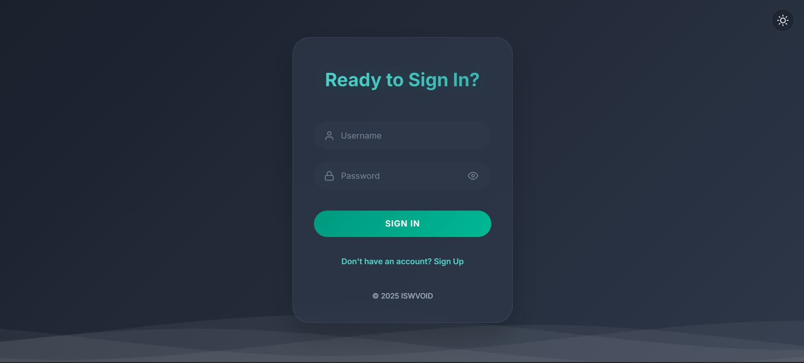
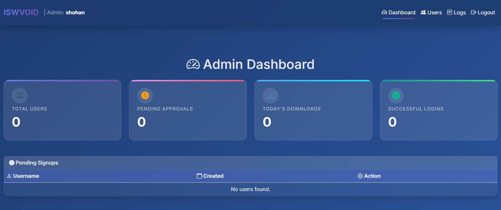
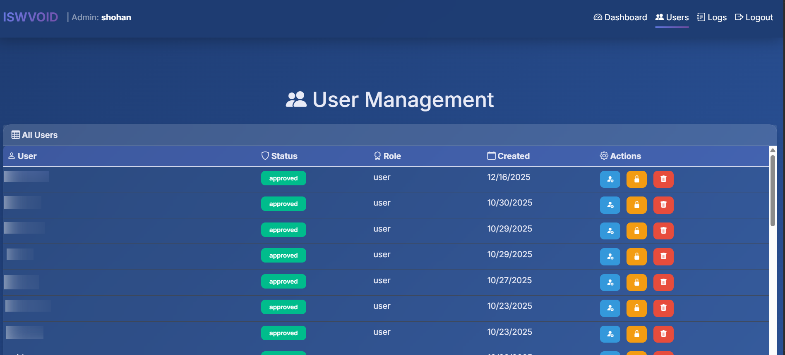
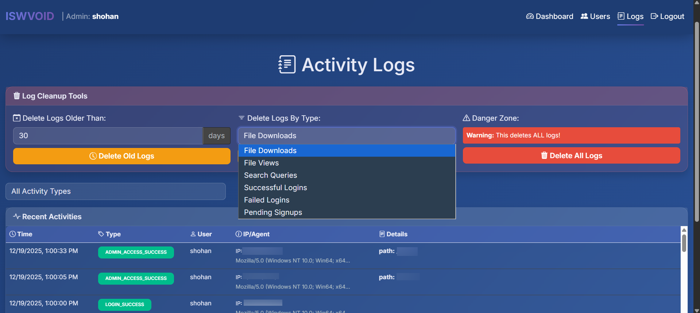
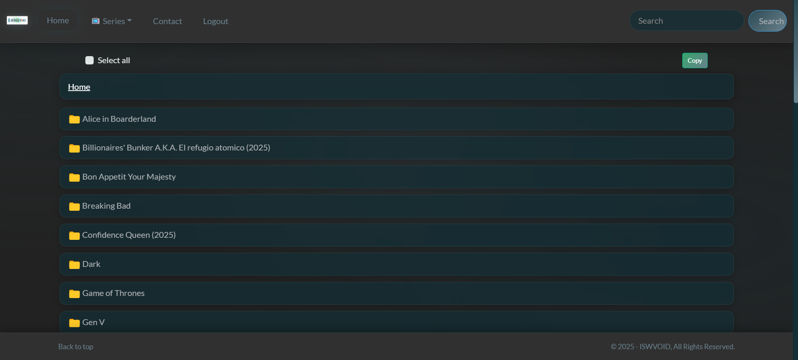
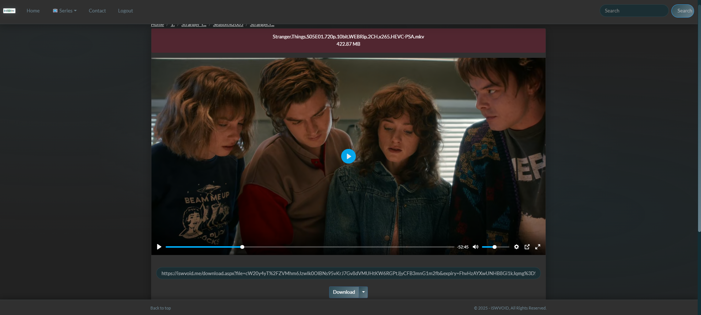
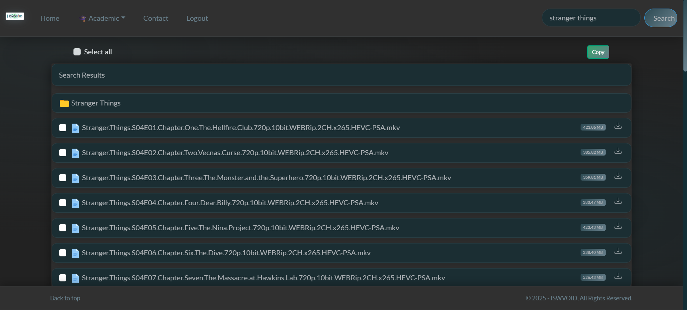

# 🚀 Enhanced Google Drive Index

A heavily modified and enhanced Google Drive Index based on [Parveen Bhadoo's GDI](https://gitlab.com/GoogleDriveIndex/Google-Drive-Index). Features a stunning dark glassmorphism UI, admin panel with user management, and KV-based activity logging.

<!-- ADD_SCREENSHOT: homepage -->


---

## ✨ Features

### 🔐 Authentication System
Beautiful animated login page with wave effects and smooth transitions. Supports both light and dark themes with glassmorphism design.

<!-- ADD_SCREENSHOT: login_page -->


**Login Page Highlights:**
- ⚡ Smooth CSS animations with wave effects
- 🌓 Auto dark/light mode support
- ✨ Glassmorphism card design with blur effects
- 🎭 Animated rotating title text
- 📱 Fully responsive on all devices
- 🔄 Seamless transitions between states

---

### 🛡️ Admin Panel
Full-featured admin dashboard for managing users and monitoring activity.

<!-- ADD_SCREENSHOT: admin_dashboard -->


**Dashboard Features:**
- 📊 Real-time statistics (users, downloads, logins)
- ⏳ Pending signup approvals at a glance
- 👥 Complete user management (approve, block, delete)
- 🏷️ Role-based access control (admin/user)

<!-- ADD_SCREENSHOT: admin_users -->


---

### 📋 Activity Logging
Track all user activity with powerful log management tools.

<!-- ADD_SCREENSHOT: admin_logs -->


**Log Features:**
- 🔍 Filter by activity type
- 🗑️ Cleanup tools (delete by age, type, or all)
- 📱 IP and user agent tracking
- ⏰ Timestamp for all activities

---

### 🎨 Dark Glassmorphism UI
Custom dark teal color palette with modern design elements.

<!-- ADD_SCREENSHOT: file_browser -->


**UI Highlights:**
- 🌙 Dark teal color palette (#0D1F23, #132E35, #2D4A53)
- ✨ Floating particle animations
- 🔮 Glassmorphism cards with blur effects
- 🎯 Smooth hover animations
- 📁 Golden folder icons with glow effects

---

### 🎬 Media Player
Built-in video and audio player with Plyr integration.

<!-- ADD_SCREENSHOT: video_player -->


---

### 🔍 Global Search
Search across all configured drives instantly.

<!-- ADD_SCREENSHOT: search_results -->


---

### 📱 Additional Features

| Feature | Description |
|---------|-------------|
| 📁 Multi-Drive Support | Configure multiple Google Drive folders |
| 💾 KV User Database | Cloudflare KV for persistent user storage |
| 📱 PWA Support | Installable as a Progressive Web App |
| 🔒 Session Management | IP lock and single session options |
| 🔗 Direct Link Protection | Optional protection for download links |
| ⏰ Link Expiry | Configurable file link expiration |

---

## 🚀 Quick Start

### Prerequisites
- Cloudflare account with Workers enabled
- Google Cloud Console project with Drive API enabled
- Cloudflare KV namespace (for user management)

### Deployment Steps

1. **Clone the repository**
   ```bash
   git clone https://github.com/YOUR_USERNAME/YOUR_REPO_NAME.git
   cd YOUR_REPO_NAME
   ```

2. **Copy and configure**
   ```bash
   cp worker.example.js worker.js
   ```

3. **Edit `worker.js`** with your credentials (see [Configuration Guide](CONFIGURATION.md))

4. **Deploy to Cloudflare Workers**
   - Go to [Cloudflare Workers Dashboard](https://dash.cloudflare.com/)
   - Create a new Worker
   - Paste your configured `worker.js` content
   - Bind your KV namespace as `ENV`

5. **Set up the first admin user** via KV:
   ```json
   KEY: USER:yourusername
   VALUE: {"username":"yourusername","password":"yourpassword","status":"approved","roles":["admin","user"],"created_at":1234567890}
   ```

---

## ⚙️ Configuration

See [CONFIGURATION.md](CONFIGURATION.md) for detailed setup instructions including:
- Google Cloud Console setup
- OAuth 2.0 credentials
- Drive folder IDs
- Crypto key generation
- KV namespace setup

---

## 🗺️ Roadmap

Planned features for future releases:

### 🔐 Authentication & Security
- [ ] Two-Factor Authentication (2FA)
- [ ] Password reset via email
- [ ] OAuth login (Google/GitHub)
- [ ] Rate limiting for brute force protection
- [ ] Session history for users

### 📊 Admin Panel Improvements
- [ ] Analytics dashboard with charts
- [ ] User activity graphs
- [ ] Export logs as CSV/JSON
- [ ] Bulk user actions
- [ ] Email notifications on new signups

### 📁 File Management
- [ ] File upload to Google Drive
- [ ] Create folders from UI
- [ ] Shareable links with expiry
- [ ] Favorites/Bookmarks
- [ ] Recent files history

### 🎨 UI/UX Enhancements
- [ ] Light/Dark theme toggle
- [ ] Custom color themes
- [ ] Grid/List view toggle
- [ ] Keyboard shortcuts
- [ ] Drag & drop upload

### 🔧 Technical
- [ ] Cloudflare R2 caching
- [ ] Image/video thumbnails
- [ ] More file type previews
- [ ] REST API endpoints

---

## 🙏 Credits

- Original Project: [Google Drive Index](https://gitlab.com/GoogleDriveIndex/Google-Drive-Index) by Parveen Bhadoo
- UI Framework: Bootstrap 5 with Bootswatch themes
- Media Player: [Plyr](https://plyr.io/)
- Icons: Bootstrap Icons

---

## 📄 License

This project is licensed under the MIT License - see the [LICENSE](LICENSE) file for details.

---

## 🤝 Contributing

Contributions are welcome! Please feel free to submit a Pull Request.

---

<p align="center">
  Made with ❤️ | Powered by Cloudflare Workers
</p>
